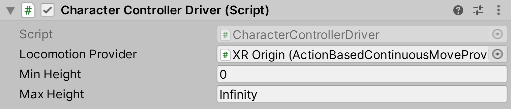

<<<<<<< HEAD
# Character Controller Driver

Controls a [Character Controller](https://docs.unity3d.com/Manual/class-CharacterController.html) height and center position based on the camera's (HMD) position upon locomotion events of a [`LocomotionProvider`](xref:UnityEngine.XR.Interaction.Toolkit.LocomotionProvider) (typically the continuous movement provider). This allows the collider on the main XR Origin rig to resize to the player's height before trying to move with thumbstick input.

| **Property** | **Description** |
|---|---|
| **Locomotion Provider** | The `LocomotionProvider` object to listen to for locomotion events. |
| **Min Height** | The minimum height of the character's capsule that this behavior sets. |
=======
# Character Controller Driver

Controls a [Character Controller](https://docs.unity3d.com/Manual/class-CharacterController.html) height and center position based on the camera's (HMD) position upon locomotion events of a [`LocomotionProvider`](xref:UnityEngine.XR.Interaction.Toolkit.LocomotionProvider) (typically the continuous movement provider). This allows the collider on the main XR Origin rig to resize to the player's height before trying to move with thumbstick input.

| **Property** | **Description** |
|---|---|
| **Locomotion Provider** | The `LocomotionProvider` object to listen to for locomotion events. |
| **Min Height** | The minimum height of the character's capsule that this behavior sets. |
>>>>>>> 5386830ea95ecb9f6ce72cd172faa6cc6f38de24
| **Max Height** | The maximum height of the character's capsule that this behavior sets. |