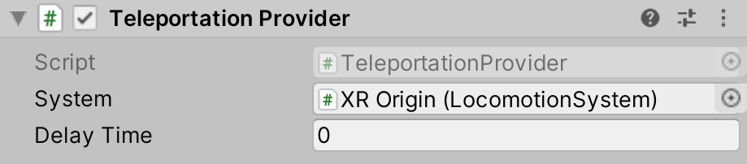

<<<<<<< HEAD
# Teleportation Provider

The `TeleportationProvider` is responsible for moving the XR Origin to the desired location on the user's request.

| **Property** | **Description** |
|---|---|
| **System** | The [LocomotionSystem](locomotion-system.md) that this `LocomotionProvider` communicates with for exclusive access to an XR Origin. If one is not provided, the behavior will attempt to locate one during its `Awake` call. |
=======
# Teleportation Provider

The `TeleportationProvider` is responsible for moving the XR Origin to the desired location on the user's request.

| **Property** | **Description** |
|---|---|
| **System** | The [LocomotionSystem](locomotion-system.md) that this `LocomotionProvider` communicates with for exclusive access to an XR Origin. If one is not provided, the behavior will attempt to locate one during its `Awake` call. |
>>>>>>> 5386830ea95ecb9f6ce72cd172faa6cc6f38de24
| **Delay Time** | The time (in seconds) to delay the teleportation once it is activated. This delay can be used, for example, as time to set a tunneling vignette effect as a VR comfort option. |